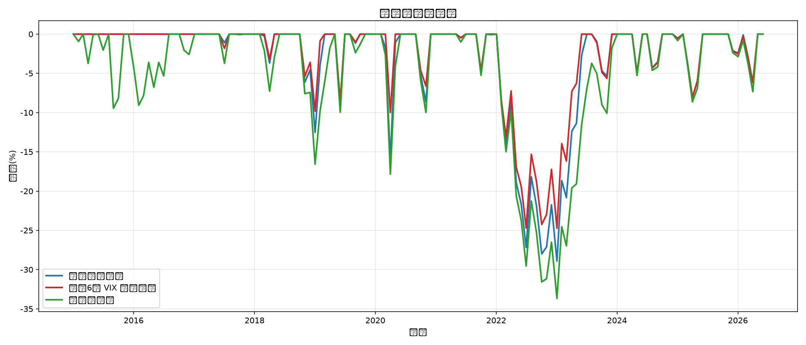

# VIX-纳斯达克100定投策略回测报告（同总投入口径）

> **生成时间**: 2026-07-01 11:26
> **数据范围**: 2015-01-01 至今
> **标的**: QQQ (Invesco QQQ Trust - 纳斯达克100 ETF)
> **恐慌指数**: ^VIX (CBOE Volatility Index)

---

## 回测前提（关键）

- 三种策略 **总投入严格一致**：`$138,000`
- 普通定投：每月固定 `$1,000`
- VIX等额定投：按6档倍数分配，单位投入约 `$554.22`，总额仍为 `$138,000`
- 一次性满仓：首月一次性投入全部资金

## 排名维度参考

| 策略 | 总投入 | 期末资产 | 总收益率 | 复合年化(IRR) | 最大回撤 |
|------|--------|----------|----------|---------------|----------|
| 普通固定定投 | $138,000 | $514,699.68 | 272.97% | 21.57% | 28.91% |
| 精细 6 档 VIX 等额定投 | $138,000 | $485,284.82 | 251.66% | 21.80% | 24.73% |
| 一次性满仓 | $138,000 | $1,082,745.03 | 684.60% | 19.78% | 33.67% |

## VIX 6档规则

| VIX区间 | 倍数 | 标签 |
|---------|------|------|
| 0-15 | 1.0x | 正常 |
| 15-20 | 1.5x | 轻度偏高 |
| 20-25 | 2.0x | 中度恐慌 |
| 25-30 | 3.0x | 高度恐慌 |
| 30-40 | 5.0x | 极度恐慌 |
| >= 40 | 8.0x | 罕见恐慌 |

### 执行统计
- 定投月数：138
- 触发加仓月数（>1x）：93
- 高恐慌月数（>=5x）：9

## 图表

---

*报告由 `scripts/vix_ndx_backtest.py` 自动生成*