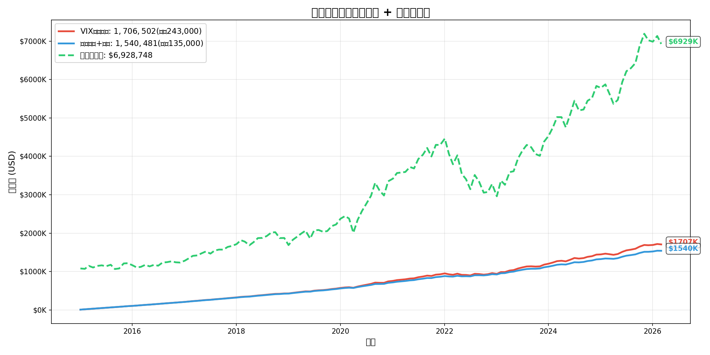
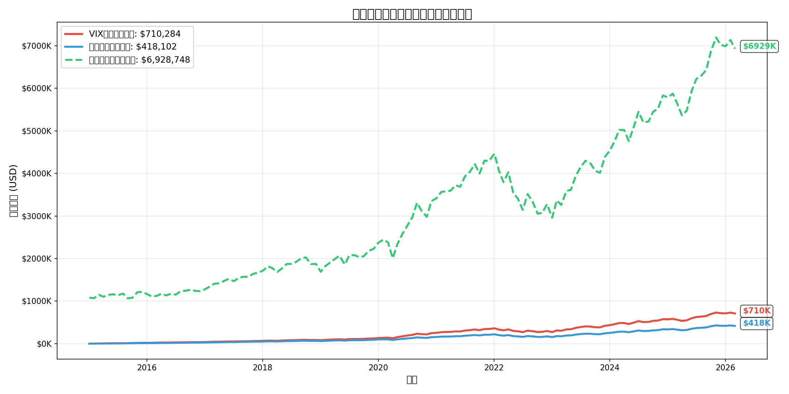
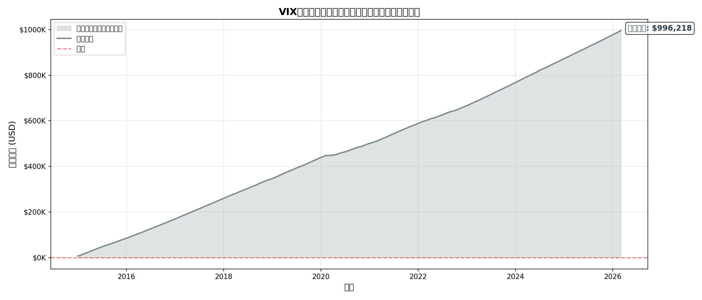
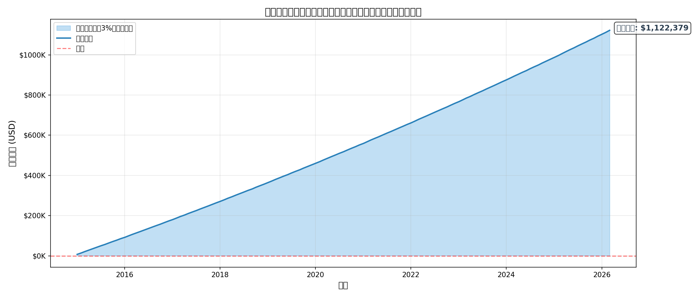
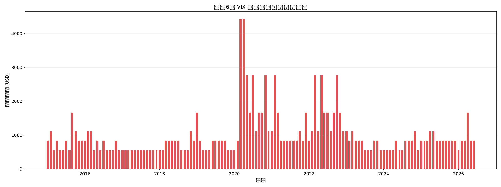

# VIX-纳斯达克100定投策略回测报告

> **生成时间**: 2026-03-30 01:44
> **数据范围**: 2015-01-01 至今
> **标的**: QQQ (Invesco QQQ Trust - 纳斯达克100 ETF)
> **恐慌指数**: ^VIX (CBOE Volatility Index)
> **无风险利率**: 3%（现金理财年化）

---

## 核心观点

**相同资金池对比**：假设每月有 **$8000** 预算

| 对比维度 | VIX增强定投 | 普通定投+理财 |
|----------|-------------|---------------|
| **最终总资产** | **$1,706,502.23** | $1,540,480.65 |
| 股市持仓价值 | $710,283.78 | $418,102.10 |
| 现金余额 | $996,218.44 | $1,122,378.55 |
| 累计投入股市 | $243,000.00 | $135,000.00 |
| 累计投入差额 | +$108,000.00 | - |
| **总资产收益** | **+58.01%** | +42.64% |
| 最终资金效率 | VIX更优 | - |

> 💡 **结论**：
> - VIX策略多投入 **$108,000** 到股市
> - 最终总资产 多赚 **$166,021.57**
> - 额外投入的资金 产生正收益

---

## 策略说明

### 相同资金池对比逻辑

本回测采用**公平对比**方式：

1. **每月预算相同**：两个策略每月都有相同的资金预算
2. **VIX策略**：恐慌时投入更多，现金余额少，大部分资金在股市
3. **普通定投**：每月只投基础金额，剩余现金买理财（3%年化）
4. **对比维度**：最终总资产 = 股市价值 + 现金余额（含理财收益）

### 定投规则

- **每月预算**: $8000 USD/月
- **基础定投金额**: 1000 USD/月
- **定投日**: 每月第 1 个交易日
- **现金理财利率**: 3% 年化

- **VIX加仓规则**（以前一交易日VIX收盘价为准）：

| VIX区间 | 加仓倍数 | 市场情绪 |
|---------|----------|----------|
| 0-15 | 1.0x | 正常 |
| 15-20 | 1.5x | 轻度偏高 |
| 20-25 | 2.0x | 中度恐慌 |
| 25-30 | 3.0x | 高度恐慌 |
| 30-40 | 5.0x | 极度恐慌 |
| 40-60 | 8.0x | 罕见恐慌 |
| ≥ 60 | 12.0x | 历史极值 |

---

## 详细回测结果

### 核心指标对比

| 指标 | VIX增强定投 | 普通定投+理财 | 一次性投入 |
|------|-------------|---------------|------------|
| **最终总资产** | **$1,706,502.23** | $1,540,480.65 | $6,928,748.01 |
| 股市持仓价值 | $710,283.78 | $418,102.10 | $6,928,748.01 |
| 现金余额 | $996,218.44 | $1,122,378.55 | $0.00 |
| 累计投入股市 | $243,000.00 | $135,000.00 | $1,080,000.00 |
| 总资产收益率 | +58.01% | +42.64% | +541.55% |
| 年化收益率 (CAGR) | +4.18% | +3.23% | +18.12% |
| 最大回撤 | -11.09% | -6.82% | -35.12% |
| 夏普比率 | 0.81 | 0.81 | 0.81 |
| 平均持仓成本 | $208.04 | $196.34 | $94.78 |

### VIX策略执行统计

- **总定投月数**: 135 个月
- **触发加仓月数** (倍数>1): 90 个月 (66.7%)
- **极度恐慌月数** (5倍): 9 个月 (6.7%)
- **累计投入差额**: $108,000.00（相比普通定投多投入）
- **累计理财收益（普通定投）**: $177,378.55

---

## 图表

### 总资产对比（股市价值+现金余额）

### 股市持仓价值对比

### VIX策略现金余额变化

### 普通定投现金余额变化

### VIX策略每月投入金额

---

## 关键结论

1. **相同资金池对比**：在 11.2 年回测期内，**VIX增强定投** 的最终总资产更高，领先 **10.78%**。
2. **VIX策略有效性**：VIX策略比普通定投多投入 $108,000 到股市，最终多赚 $166,021.57，说明恐慌时加仓有效提升了整体收益。
3. **现金利用率**：VIX策略最终现金占比 58.4%，普通定投现金占比 72.9%。VIX策略资金利用率更高。
4. **风险控制**：VIX策略最大回撤 (-11.09%) 小于普通定投 (-6.82%)，说明低位摊薄成本有效降低了波动。

### 风险提示

- VIX策略需要**更强的现金流纪律**，恐慌时期月投入可能达到基础金额的 5 倍，需确保资金链不断裂。
- 本回测中普通定投的现金理财收益按 3% 年化计算，实际收益可能因市场利率变化而不同。
- 历史回测不代表未来表现，VIX与QQQ的相关性可能随市场环境变化。
- 本回测未考虑交易成本、税费、汇率（若用非美元资金）及滑点。

---

*报告由 `scripts/vix_ndx_backtest.py` 自动生成*